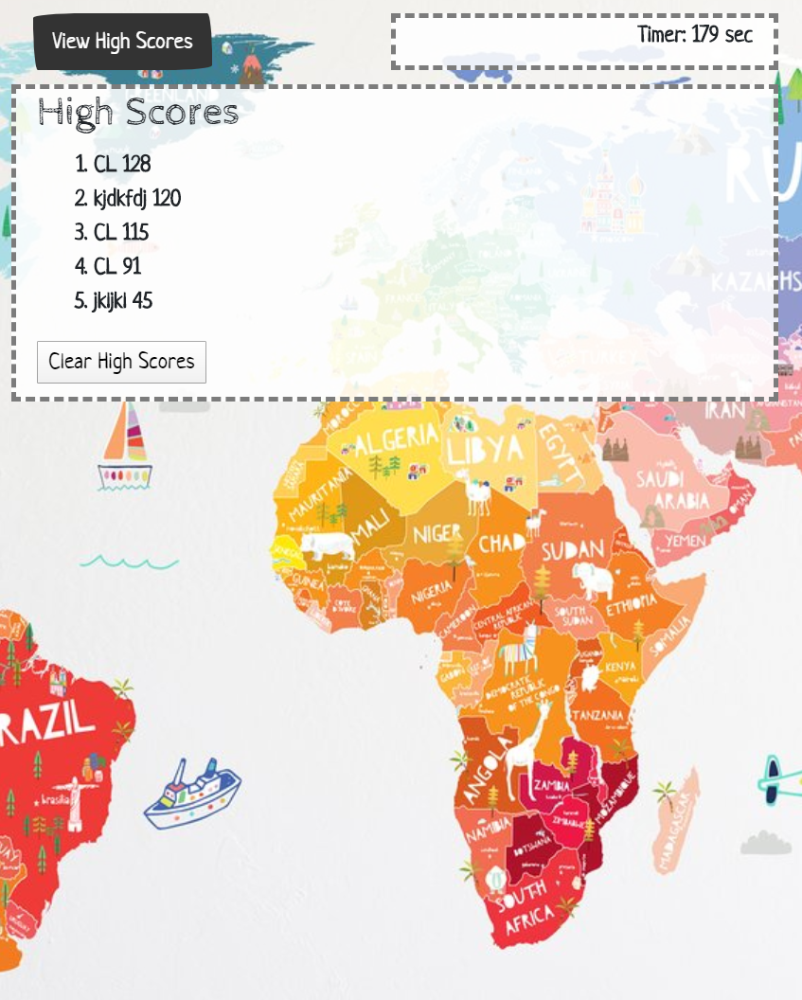

# World-Capitals-Quiz
*A quiz that tests your knowledge of capitals around the world.*
[Click here to play the quiz.]( https://cml2377.github.io/World-Capitals-Quiz/)
------
The page opens to the start screen, where you read the instructions, and can check the high scores in the upper left corner.
{:height="50%" width="50%"}
------
For each question you answer, the page will tell you if you are correct or incorrect. If you are incorrect, the page deducts 10 seconds from the timer.
{:height="50%" width="50%"}
------
Input your initials to save your high score. Your initials and high score are saved in local Storage so if you clear high scores, it will become blank again. 
{:height="50%" width="50%"}